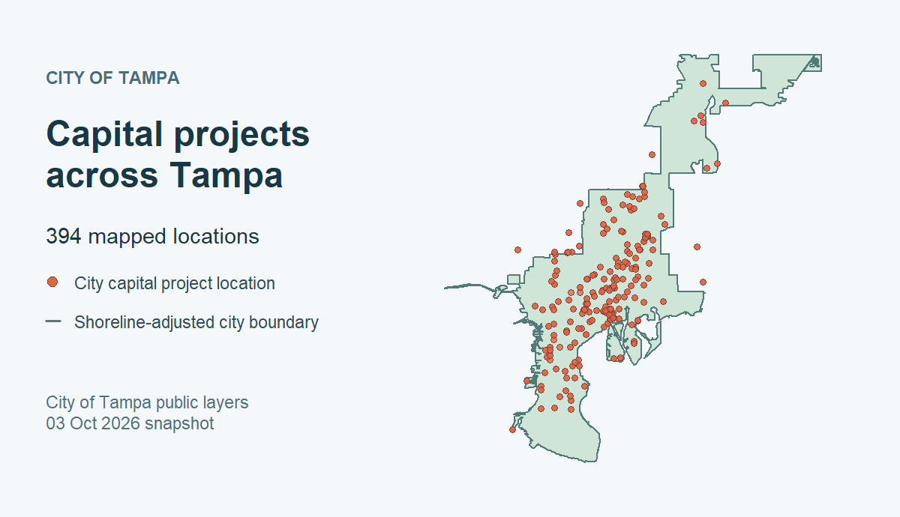

# tampaBayOpenData

<p class="tb-lede">Discover and retrieve public data across Tampa Bay from one R interface.</p>
<p class="tb-kicker">35 maintainer-checked layers · live discovery across six public ArcGIS publishers</p>

<!-- badges: start -->
[](https://github.com/Jaclenga/tampaBayOpenData/blob/main/DESCRIPTION)
[](LICENSE.md)
[](https://github.com/Jaclenga/tampaBayOpenData/actions/workflows/R-CMD-check.yaml)
[](https://github.com/Jaclenga/tampaBayOpenData/actions/workflows/pkgcheck.yaml)
[](https://github.com/Jaclenga/tampaBayOpenData/actions/workflows/test-coverage.yaml)
<!-- badges: end -->

## What is tampaBayOpenData?

Public data is spread across separate ArcGIS portals. Finding a layer, getting
its records, and recording its source can make regional analysis hard to repeat.
`tampaBayOpenData` gives researchers, planners, journalists, and civic
technologists a consistent path from **discovery → retrieval → analysis → source
provenance**. It covers Tampa, St. Petersburg, Clearwater, Hillsborough County,
Pinellas County, and the Tampa Bay Regional Planning Council.

The bundled Tampa Bay catalog can be searched offline. Live discovery reaches
its six configured public publishers or another public ArcGIS portal or
FeatureServer/MapServer URL supplied by the caller. Retrieval contacts the
publisher's service.

## Install

Install the current version from GitHub in an R console:

```r
install.packages("pak") # if needed
pak::pak("Jaclenga/tampaBayOpenData")
```

Install the optional `sf` package for spatial results.

## Identify your requests

Requests to publisher services use `tampaBayOpenData/0.1.0` as the default
user agent. Set a package option before live discovery, retrieval, or downloads
if you need to identify your own application:

```r
options(tampaBayOpenData.user_agent = "my-project/1.0 (contact: me@example.org)")
```

Set `options(tampaBayOpenData.user_agent = NULL)` to restore the default.

## Find data

```r
library(tampaBayOpenData)

tbod_search_datasets("parks")
tbod_search_datasets("housing", source = "live", portals = "city")
```

The first search includes checked entries and scans live portals. To browse
only the bundled catalog without a network request, use
`tbod_search_datasets("parks", source = "checked")`. The second search restricts live
discovery to Tampa's portal. The [discovery
guide](https://jaclenga.github.io/tampaBayOpenData/articles/discovery.html)
explains filters, other publishers, and bounded searches.

To search another ArcGIS organization, provide its public sharing REST root.
The result rows can be passed directly to the same retrieval function:

```r
# Replace this example address with your portal's public sharing REST root.
other <- tbod_discover("https://example.maps.arcgis.com/sharing/rest",
                       query = "parks")
if (nrow(other)) data <- tbod_get_dataset(other[1, ], limit = 100)
```

A stable `arcgis:<item-id>:<layer-id>` ID from another portal can be used
later with `tbod_get_dataset(id, portal = "https://example.maps.arcgis.com/sharing/rest")`.
Pass a service root to `tbod_discover()` to enumerate its queryable layers.

## Retrieve data

```r
parks <- tbod_get_dataset("stpete-parks", limit = 100)
head(parks)
```

A checked ID is a stable package name for a maintainer-validated layer.
Retrieval uses the publisher's live service and returns a tibble by default.
An ID shared by multiple catalog jurisdictions requires an explicit
`jurisdiction` argument; unique IDs resolve without one.
Pass a public `FeatureServer/<id>` or `MapServer/<id>` URL to
`tbod_get_dataset()` to retrieve a layer outside the bundled catalog. See the
[retrieval guide](https://jaclenga.github.io/tampaBayOpenData/articles/retrieval.html)
for field filters, integrity checks, and resumable downloads.

Checked entries include a field, geometry, and CRS snapshot. Retrieval checks
the live layer metadata against that snapshot before querying records. Added
fields or changed aliases produce a warning; removed, renamed, or changed-type
fields, object-ID, geometry, CRS, endpoint changes, and vanished endpoints
stop retrieval. Inspect a layer first with `tbod_schema(id)` and
`tbod_check_schema(id)`. For a direct URL, save
`tbod_schema(url, refresh = TRUE)` and later pass it as
`tbod_check_schema(url, expected = baseline)`.

## See spatial data

This map uses the checked City of Tampa `city-boundary` and `capital-projects`
layers. Both can be retrieved as `sf` objects:

```r
boundary <- tbod_get_dataset("city-boundary", fields = "OBJECTID",
                        spatial = TRUE, out_sr = 4326)
projects <- tbod_get_dataset("capital-projects", fields = "OBJECTID",
                        spatial = TRUE, out_sr = 4326)

plot(sf::st_geometry(boundary), col = "#CFE5D8", border = "#527A76")
plot(sf::st_geometry(projects[!sf::st_is_empty(projects), ]),
     add = TRUE, pch = 21, bg = "#DB6745")
```



*City of Tampa data retrieved October 3, 2026 (both ArcGIS items marked CC0).
This snapshot is illustrative: the shoreline-adjusted boundary is not a legal
survey, and mapped points do not establish current project status or complete
coverage. The committed image keeps site builds independent of live HTTP.
[Reproduce the map](https://github.com/Jaclenga/tampaBayOpenData/blob/main/tools/render-home-map.R)
or read the [spatial walkthrough](https://jaclenga.github.io/tampaBayOpenData/articles/introduction.html#work-with-spatial-data).*

## Trace the source

```r
source <- tbod_provenance(parks)
source[c("publisher", "source_url", "retrieved_at", "complete")]
```

Provenance also records validation status, the query, returned row counts, and
the integrity method. Save it with results before transformations that may drop
R attributes. The [coverage and provenance
guide](https://jaclenga.github.io/tampaBayOpenData/articles/coverage.html)
explains how to interpret the source and its limits.

## Why use it?

- Discover layers across six configured publishers and distinguish the 35
  checked layers from newly discovered candidates.
- Retrieve typed R tables or optional `sf` objects with source provenance and
  checks for missing or duplicate records.
- Download large results in resumable chunks when an in-memory result is
  impractical.

| Alternative | Relationship to `tampaBayOpenData` |
| --- | --- |
| [`nycOpenData`](https://docs.ropensci.org/nycOpenData/) | An R interface for New York City's Socrata data; this package focuses on Tampa Bay's ArcGIS publishers. |
| [Direct ArcGIS REST requests](https://developers.arcgis.com/rest/services-reference/enterprise/query-feature-service-layer/) | Useful with a known service URL; this package adds a regional registry, checked IDs, typed results, and retrieval provenance. |
| [`arcgislayers`](https://r.esri.com/arcgislayers/) | General ArcGIS access; this package supplies a focused regional catalog and records whether a layer was checked or only discovered. |

## Coverage and source limits

| Public publisher | Checked layers | Live discovery |
| --- | ---: | :---: |
| City of Tampa | 20 | Yes |
| City of St. Petersburg | 3 | Yes |
| City of Clearwater | 3 | Yes |
| Hillsborough County | 3 | Yes |
| Pinellas County | 3 | Yes |
| Tampa Bay Regional Planning Council | 3 | Yes |

A **checked** layer has been validated by the package maintainers. A
**discovered** layer came from a public portal search and has not received that
same validation; inspect its metadata and reuse terms before use. The checked
catalog is a selected set, not a complete inventory of publisher data.

> **Source limits:** These are live publisher services, not a complete or frozen
> historical database. Some layers are active views, boundaries may be
> approximate, and records can change during retrieval. The TBRPC storm surge
> layer is a historical planning model, not current emergency guidance. The
> package's MIT license covers its code, not government data. It is independent
> of the source organizations and rOpenSci.

Read the [coverage and source limitations
guide](https://jaclenga.github.io/tampaBayOpenData/articles/coverage.html)
for specific layer caveats, validation, monitoring, and data-use details.

## Citation

Cite both `tampaBayOpenData` and the original data publisher and dataset. After
installation, get the package citation or a BibTeX entry with:

```r
citation("tampaBayOpenData")
toBibtex(citation("tampaBayOpenData"))
```

The [citation page](https://jaclenga.github.io/tampaBayOpenData/authors.html#citation)
has the package details. `tbod_dataset_info(id)` provides source information,
and `tbod_provenance(result)` records the retrieval source and time. Existing
unprefixed function names remain available for compatibility.

## Learn more

- [Get started](https://jaclenga.github.io/tampaBayOpenData/articles/introduction.html):
  a longer walkthrough with a reproducible spatial example.
- [Discovering data](https://jaclenga.github.io/tampaBayOpenData/articles/discovery.html),
  [retrieving and downloading](https://jaclenga.github.io/tampaBayOpenData/articles/retrieval.html),
  and [coverage and provenance](https://jaclenga.github.io/tampaBayOpenData/articles/coverage.html):
  detailed workflows and caveats.
- [Function reference](https://jaclenga.github.io/tampaBayOpenData/reference/index.html)
  and [changelog](https://jaclenga.github.io/tampaBayOpenData/news/index.html).
- [Architecture](https://github.com/Jaclenga/tampaBayOpenData/blob/main/docs/architecture.md),
  [validation record](https://github.com/Jaclenga/tampaBayOpenData/blob/main/docs/validation.md),
  and [test guide](https://github.com/Jaclenga/tampaBayOpenData/blob/main/tests/README.md):
  implementation, dated checks, and test methods.
- [Bicycle network notebook](https://github.com/Jaclenga/tampaBayOpenData/blob/main/inst/examples/bike-network.Rmd)
  and [contributing guide](https://github.com/Jaclenga/tampaBayOpenData/blob/main/CONTRIBUTING.md).

The design was inspired by rOpenSci's [`nycOpenData`](https://docs.ropensci.org/nycOpenData/);
the ArcGIS client was implemented independently.
